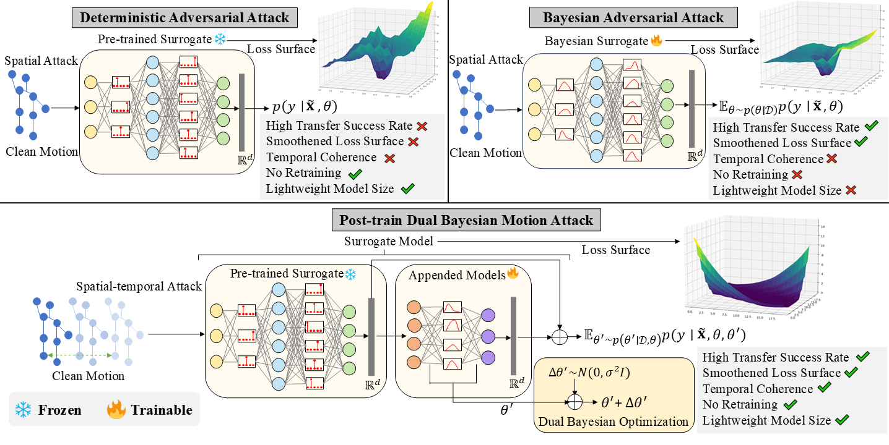

# Skeleton-Robustness-Benchmark(RobustBenchHAR)

RobustBenchHAR is a pytorch framework to boost and evaluate the adversarial robustness for Human skeletal behavior recognition. Official code for the paper:

> **[ICLR2025 TASAR: Transfer-based Attack on Skeletal Action Recognition](https://arxiv.org/abs/2409.02483)**

<div style="text-align: center;">

</div>

Key Features of RobustBenchHAR:
+ **The first large-scale benchmark for evaluating adversarial robustness in human Activity Recognition (HAR)**: RobustBenchHAR ensembles existing adversarial attacks including several types and fairly evaluates various attacks under the same setting.
+ **Evaluate the robustness of various models and datasets**: RobustBenchHAR provides a plug-and-play interface to verify the robustness of models on different data sets.
+ **A summary of transfer-based attacks and defenses**: RobustBenchHAR reviews multiple adversarial attacks and defenses, making it easy to get the whole picture of attacks for practitioners.

## Dataset and Checkpoints
1. We adopt the Dataset in [BEAT](https://github.com/realcrane/Defending-Black-box-Skeleton-based-Human-Activity-Classifiers/tree/main), you can download it from [BaiduNetdisk link](https://pan.baidu.com/s/1s2IzT_hX3IHQ9qWxIwQZng?pwd=9rwa)

2. The hdm05 checkpoints we used in our experiments can be downloaded from [BaiduNetdisk link](https://pan.baidu.com/s/1HLtNmDoaFY5mUPbJdefvQQ?pwd=5d9c)

3. The complete checkpoints will be available soon...

4. The hugging face link will be available soon...


## Usage
The detailed benchmark setting are available in "TASAR: Transfer-based Attack on Skeletal Action Recognition". The complete usage is as follows:

**For any action on the ensemble models, add parameters “--ensemble True”**

## Train

```
python main.py -classifier STGCN --routine train --dataset hdm05 --trainFile classTrain.npz --testFile classTest.npz --dataPath ../data/ --retPath ../results/ -ep 80 -cn 65 -bs 64 -lr 0.1
```

Training the classifier will generate two models by default: the minimal loss model minLossModel.pth and the minimal validation loss model minValLossModel.pth under --result

## Test

```
python main.py -classifier STGCN --routine test --dataset hdm05 --testFile classTest.npz --trainedModelFile minValLossModel.pth --dataPath ../data/ -retPath ../results/ -cn 65 -bs 64
```

## Collect all the correctly recognised samples for attack

```
python main.py -classifier STGCN --routine gatherCorrectPrediction --dataset hdm05 --testFile classTest.npz --trainedModelFile minValLossModel.pth --dataPath ../data/ -retPath ../results/ -cn 65
```

This process by default generates a file called adClassTrain.npz under --retFolder, which contains all the correctly recognised samples for attack. If acting on the ensemble models:

```
python main.py -classifier STGCN,CTRGCN,MSG3D --routine gatherCorrectPrediction --dataset hdm05 --testFile classTest.npz --trainedModelFile minValLossModel.pth --dataPath ../data/ -retPath ../results/ -cn 65 --ensemble True
```

## Attack(untargeted attack by default)

## Gradient-based

1. **[I-FGSM](https://arxiv.org/abs/1412.6572)**,  **[MI-FGSM](https://openaccess.thecvf.com/content_cvpr_2018/papers/Dong_Boosting_Adversarial_Attacks_CVPR_2018_paper.pdf)**, **[SMART](https://openaccess.thecvf.com/content/CVPR2021/papers/Wang_Understanding_the_Robustness_of_Skeleton-Based_Action_Recognition_Under_Adversarial_Attack_CVPR_2021_paper.pdf)**, **[MIG](https://openaccess.thecvf.com/content/ICCV2023/papers/Ma_Transferable_Adversarial_Attack_for_Both_Vision_Transformers_and_Convolutional_Networks_ICCV_2023_paper.pdf)**, **[CIASA](https://ieeexplore.ieee.org/abstract/document/9302639)**

```
python main.py -classifier STGCN --routine attack -attacker [FGSM, MI-FGSM, SMART, MIG, CIASA] --trainedModelFile minValLossModel.pth -cp 0.01 --dataset hdm05 --trainFile adClassTrain.npz --testFile classTest.npz --dataPath ../results/ -retPath ../results/ -cn 65 --epochs 200 --batchSize 16 --attackType untarget
```


## Input transformation-based

1. **[DIM](https://arxiv.org/abs/1803.06978)**

```
python main.py -classifier STGCN --routine attack -attacker Augment --trainedModelFile minValLossModel.pth -cp 0.01 --dataset hdm05 --trainFile adClassTrain.npz --testFile classTest.npz --dataPath ../results/ -retPath ../results/ -cn 65 --epochs 200 --batchSize 16 --attackType untarget
```

## Ensemble-based

1. **[ENSEMBLEA](https://openaccess.thecvf.com/content_cvpr_2018/papers/Dong_Boosting_Adversarial_Attacks_CVPR_2018_paper.pdf)**, **[SVRE](https://arxiv.org/pdf/2111.10752)**

```
python main.py -classifier STGCN,CTRGCN,MSG3D --routine attack -attacker [ENSEMBLE, SVRE] --trainedModelFile minValLossModel.pth -cp 0.01 --dataset hdm05 --trainFile adClassTrain.npz --testFile classTest.npz --dataPath ../results/ -retPath ../results/ -cn 65 --epochs 200 --batchSize 16 --attackType untarget --ensemble True
```

2. **[BA](https://arxiv.org/pdf/2302.05086)**

Before starting the attack, you first need to fine-tune to get the surrogate model by:

```
python main.py -classifier STGCN --routine finetune --dataset hdm05 --trainFile classTrain.npz --testFile classTest.npz --dataPath ../data/ --retPath ../results/ -ep 20 -cn 65 -bs 64 -lr 0.01
```

Then attack by:

```
python main.py -classifier STGCN --routine attack -attacker BA --trainedModelFile minValLossModel.pth -cp 0.01 --dataset hdm05 --trainFile adClassTrain.npz --testFile classTest.npz --dataPath ../results/ -retPath ../results/ -cn 65 --epochs 200 --batchSize 16 --attackType untarget
```

3. **TASAR**

**Noting: If you want to quickly reproduce the results of this paper, you can use the checkpoints provided above.**

You first need to post-train the pre-trained model by:

```
python main_TASAR.py -classifier ExtendedBayesian --baseClassifier STGCN --routine bayesianTrain --dataset hdm05 -adTrainer PDBATrainer --trainFile classTrain.npz --testFile classTest.npz --dataPath ../data/ --retPath ../results/ -ep 5 -cn 65 --trainedModelFile minValLossModel.pth -bs 32 -lr 2e-3 --bayesianModelNum 3
```

Then perform the The Dual Bayesian sampling in post-train models

```
python main_TASAR.py -classifier ExtendedBayesian --baseClassifier STGCN --routine DualBayesian --dataset hdm05 -adTrainer PDBATrainer --trainFile classTrain.npz --testFile classTest.npz --dataPath ../data/ --retPath ../results/ -ep 5 -cn 65 --trainedModelFile minValLossModel.pth -bs 32 -lr 2e-3 --bayesianModelNum 3 --trainedAppendedModelFile yes
```

Meanwhile, You also need to calculate the timing parameters of the data for **motion gradient**.

```
python main_TASAR.py -classifier ExtendedBayesian --baseClassifier STGCN --routine AR --attacker TASAR --trainedModelFile minValLossModel.pth --adTrainer PDBATrainer --updateRule Adam --dataset hdm05 --trainFile adClassTrain.npz --testFile classTest.npz --dataPath ../data/ -retPath ../results/ -cn 65 --epochs 200 --batchSize 8 --trainedAppendedModelFile yes --bayesianModelNum 3
```

Fianlly, attack by:

```
python main_TASAR.py -classifier ExtendedBayesian --baseClassifier STGCN --routine attack --attacker TASAR --trainedModelFile minValLossModel.pth --adTrainer PDBATrainer --updateRule Adam --dataset hdm05 --trainFile adClassTrain.npz --testFile classTest.npz --dataPath ../data/ -retPath ../results/ -cn 65 --epochs 200 --batchSize 8 --trainedAppendedModelFile yes --bayesianModelNum 3  -cp 0.01 --attackType untarget --temporal True

```

## Defense by Adversarial Training

1. **[TRADES](https://proceedings.mlr.press/v97/zhang19p.html)**

```
python main.py -classifier STGCN --routine adTrain --dataset hdm05 --trainFile classTrain.npz --testFile classTest.npz --dataPath ../data/ --retPath ../results/ -ep 80 -cn 65 -bs 64 -lr 0.1 --adTrainer TRADES 
```

2. **[BEAT](https://ojs.aaai.org/index.php/AAAI/article/view/25352)**

```
python main.py -classifier ExtendedBayesian --baseClassifier STGCN --routine adTrain --dataset hdm05 --trainFile classTrain.npz --testFile classTest.npz --dataPath ../data/ --retPath ../results/ -ep 80 -cn 65 -bs 64 -lr 0.1 --adTrainer EBMATrainer
```

## Transfer-based attack test

When the attack is complete, the generated adversarial examples will be saved in the folder corresponding to the attack name, you can execute transfer-based attack test.

```
python main.py -classifier STGCN --routine test --transfer_attack True --dataset ntu60 --trainedModelFile minValLossModel.pth --dataPath ../data/ -retPath ../results/ -cn 60 -bs 16 --transfer_path {adv_examples_path}
```

## Warning and Suggestion
1. The code has not been exhaustively tested. You need to run it at your own risk. The author will try to actively maintain it and fix reported bugs but this can be delayed.

2. Since the execution of TASAR requires configuring the rpy2 package, it requires setting environment variables. In order to avoid system crashes when users configure the benchmark environment, we designed two main functions, one for using benchmark and the other for TASAR. If the user is not familiar with the linux operating system, it is recommended to use the former main function.
   
## Authors

Yunfeng Diao, Baiqi Wu, Ruixuan Zhang, Ajian Liu, Xingxing Wei, Meng Wang, and He Wang

Yunfeng Diao, diaoyunfeng@hfut.edu.cn, [Faculty page](http://faculty.hfut.edu.cn/diaoyunfeng/en/index.htm)

Baiqi Wu, 2021214516@mail.hfut.edu.cn

He Wang, he_wang@@ucl.ac.uk, [Personal website](https://drhewang.com)

Project Webpage: http://drhewang.com/pages/AAHAR.html


## Citation (Bibtex)
Please cite our papers if you find our work useful:

1. Yunfeng Diao, Baiqi Wu, Ruixuan Zhang, Ajian Liu, Xingxing Wei, Meng Wang, and He Wang, TASAR: Transfer-based Attack on Skeletal Action Recognition, International Conference on Learning Representations (ICLR) 2025.

    @inproceedings{diao2025tasar,
     author = {Yunfeng Diao and Baiqi Wu and Ruixuan Zhang and Ajian Liu and Xingxing Wei and Meng Wang and He Wang},
     title = {TASAR: Transfer-based Attack on Skeletal Action Recognition},
     booktitle = {The International Conference on Learning Representations (ICLR)},
     year = {2025}
   }

2.  Yunfeng Diao*, He Wang*, Tianjia Shao, Yong-Liang Yang, Kun Zhou, David Hogg, Understanding the Vulnerability of Skeleton-based Human Activity Recognition via Black-box Attack, Pattern Recognition 2024.
  
    @article{diao2024understanding,
     title={Understanding the vulnerability of skeleton-based Human Activity Recognition via black-box attack},
     author={Diao, Yunfeng and Wang, He and Shao, Tianjia and Yang, Yongliang and Zhou, Kun and Hogg, David and Wang, Meng},
     journal={Pattern Recognition},
     volume={153},
     pages={110564},
     year={2024},
     publisher={Elsevier}
   }

3. He Wang*, Yunfeng Diao*, Zichang Tan and Guodong Guo, Defending Black-box Skeleton-based Human Activity Classifiers, the AAAI conference on Aritificial Intelligence (AAAI) 2023.
 
    @InProceedings{Wang_Defending_2023,
    author={Wang, He and Diao, Yunfeng and Tan, Zichang and Guo, Guodong},
    booktitle={Proceedings of the AAAI Conference on Artificial Intelligence},
    title={Defending Black-box Skeleton-based Human Activity Classifiers},
    year={2023},
    month={June},
    }

4. He Wang, Feixiang He, Zhexi Peng, Tianjia Shao, Yongliang Yang, Kun Zhou and David Hogg, Understanding the Robustness of Skeleton-based Action Recognition under Adversarial Attack, CVPR 2021

    @InProceedings{Wang_Understanding_2020,
    author={He Wang, Feixiang He, Zhexi Peng, Tianjia Shao, Yongliang Yang, Kun Zhou and David Hogg},
    booktitle={Proceedings of the IEEE/CVF Conference on Computer Vision and Pattern Recognition (CVPR)},
    title={Understanding the Robustness of Skeleton-based Action Recognition under Adversarial Attack},
    year={2021},
    month={June},
    }

5. Yunfeng Diao, Tianjia Shao, Yongliang Yang, Kun Zhou and He Wang, BASAR:Black-box Attack on Skeletal Action Recognition, CVPR 2021

    @InProceedings{Diao_Basar_2020,
    author={Yunfeng Diao, Tianjia Shao, Yongliang Yang, Kun Zhou and He Wang},
    booktitle={Proceedings of the IEEE/CVF Conference on Computer Vision and Pattern Recognition (CVPR)},
    title={BASAR:Black-box Attack on Skeletal Action Recognition},
    year={2021},
    month={June},
    }
